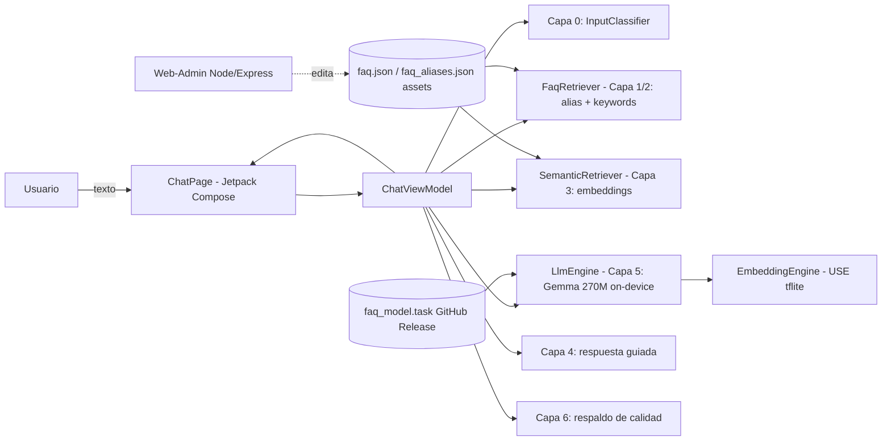
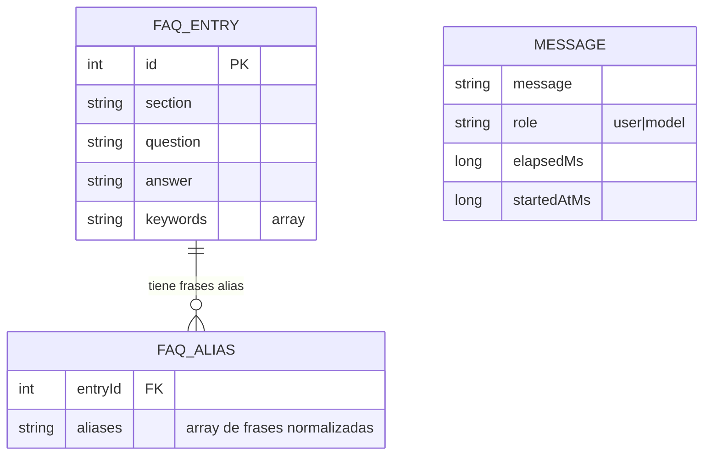

# Documento Técnico – MVP: Emprende ISTG ChatBot

**Proyecto de la asignatura:** Programación Móvil
**Plataforma:** Android (Kotlin + Jetpack Compose)
**Enfoque:** Asistente virtual *on-device* (100% en el dispositivo, sin servidor de inferencia en la nube)
**Repositorio:** `git@github.com:japuero-istg/Chatbot_Istg.git`

---

## 1. Resumen y Objetivos

### 1.1 Problema que resuelve el MVP
Los estudiantes y emprendedores del Instituto Superior Tecnológico Guayaquil (ISTG) necesitan
respuestas rápidas sobre el uso de la app **Emprende ISTG** (registro, publicación de negocios,
búsqueda, favoritos, calificaciones, ofertas y perfil). El canal habitual (leer manuales o escribir
al soporte) es lento. El MVP entrega un **chatbot conversacional que responde desde el propio
teléfono**, sin depender de internet ni de un backend, protegiendo la privacidad y funcionando
offline tras la primera descarga del modelo.

### 1.2 Propuesta de valor principal
- **Respuesta inmediata y local**: el modelo de lenguaje (Gemma 3 270M) corre en el dispositivo.
- **Alta cobertura con baja latencia**: recuperación multinivel (alias + palabras clave +
  semántica) entrega contexto al modelo y permite un *fast-path* de respuesta oficial.
- **Cero costo de servidor**: no hay APIs de pago en la nube; el despliegue es solo un APK.
- **Herramienta de contenido incluida**: un web-admin CRUD permite editar el FAQ sin tocar código.

### 1.3 Alcance inicial y métricas de éxito (KPIs)
**Alcance inicial**
- Chat funcional con 13 secciones del FAQ (60 entradas) y 60 frases alias.
- Recuperación determinística (alias/keywords) + semántica (embeddings) + generación LLM con
  respaldo de calidad.
- Web-admin para mantenimiento del FAQ (Node/Express + Playwright e2e).

**KPIs sugeridos**
| KPI | Definición | Meta MVP |
|-----|------------|----------|
| Tasa de respuesta útil | respuestas que no son eco ni fallback vacío | ≥ 85% |
| Latencia p95 | tiempo_send → tiempo_mostrado en burbuja | ≤ 4 s (Redmi Note 11) |
| Cobertura de intención | alias/keyword hit + match semántico sobre consultas | ≥ 80% |
| Crash-free sessions | sesiones sin excepción no controlada | ≥ 99% |
| Precisión de edición (web-admin) | tests e2e verdes | 4/4 |

---

## 2. Arquitectura del Sistema

### 2.1 Diagrama general de componentes



### 2.2 Flujo principal de datos (por mensaje del usuario)
1. `ChatPage` envía el texto a `ChatViewModel.sendMessage`.
2. **Capa 0** normaliza y clasifica: si es saludo/gracias/despedida/ vacío → respuesta trivial.
3. **Capa 1/2** `FaqRetriever` busca coincidencia exacta por *alias* (score 10f) o por
   palabras clave/keywords.
4. Si no hay match → **Capa 3** `SemanticRetriever` calcula embeddings (Universal Sentence
   Encoder) y filtra por `minSimilarity = 0.35`.
5. Si hay contexto → **Capa 5** `LlmEngine` genera con un *prompt RAG* (`PromptBuilder`) que
   prohíbe inventar y limita la respuesta a 2 frases.
6. **Capa 6** valida la salida: si está vacía, es un eco de la pregunta o repite el fallback
   genérico → se muestra la **respuesta oficial del FAQ**.
7. Si ninguna capa encontró contexto → **Capa 4** `buildGuidedResponse()` lista las secciones
   reales y pide reformular.
8. La respuesta se añade al `messageList` (en memoria) y se lee por TTS.

### 2.3 Decisiones de diseño
- **On-device / edge, no microservicios ni monolito en la nube**: para un MVP de programa móvil
  se priorizó privacidad, offline y costo cero. Toda la inteligencia vive en el APK + modelo
  descargable.
- **Recuperación multinivel antes del LLM**: reduce latencia y alucinaciones; el modelo solo
  redacta sobre contexto verificado.
- **Respaldo de calidad determinístico**: como el modelo 270M es pequeño y a veces "se calla"
  (`rawChars=0`) o repite la pregunta, siempre existe una respuesta oficial de respaldo.
- **MVVM + Compose**: `ChatViewModel` aísla la lógica de la UI; los datos se exponen vía
  `mutableStateListOf` / `State`.

---

## 3. Stack Tecnológico

| Capa | Tecnología |
|------|-----------|
| Lenguaje | **Kotlin** 1.9 (JVM target 1.8) |
| UI | **Jetpack Compose** (BOM), Material 3, `material-icons-extended` |
| Arquitectura | MVVM (`ViewModel`, `ViewModelProvider.Factory`), corrutinas |
| LLM on-device | **MediaPipe LLM Inference API** (Tasks-GenAI legacy) → **Gemma 3 270M instruct (q8)**, `~304 MB`, descargado al primer uso |
| Embeddings | **MediaPipe TextEmbedder** → **Universal Sentence Encoder** (`.tflite`, ~5.8 MB en assets) |
| Serialización | `kotlinx.serialization.json` |
| Web-admin | **Node.js + Express**, frontend vanilla JS, **Playwright** (e2e) |
| Control de versiones | **Git** + **GitHub** (`japuero-istg/Chatbot_Istg`) |
| Gestión de proyecto | GitHub Issues / ramas; Milestones por fase |
| Build | **Gradle** (Android Gradle Plugin), `assembleDebug` |
| Entorno | `minSdk = 24`, `compileSdk = 34`, `targetSdk = 34` |

---

## 4. Modelo de Datos y Contratos

### 4.1 Entidades (sin SQL; se usa JSON en `assets/` + caché en memoria)



- `faq.json`: 60 entradas, 13 secciones (`section`, `question`, `answer`, `keywords[]`).
- `faq_aliases.json`: 60 bloques `{ entryId, aliases[] }` para match exacto por frase.
- `MESSAGE`: historial de chat, **solo en memoria** (`mutableStateListOf`), no persiste.

### 4.2 API del Web-Admin (Node/Express, local)
El web-admin es la única interfaz para editar el FAQ. Soporta `FAQ_DATA_DIR` para aislar datos
(en tests). Respuestas en JSON.

| Método | Endpoint | Descripción | Respuestas |
|--------|----------|-------------|------------|
| GET | `/api/faq` | Lista entradas del FAQ | 200 `FaqEntry[]` |
| GET | `/api/aliases` | Lista aliases | 200 `FaqAlias[]` |
| GET | `/api/sections` | Secciones únicas | 200 `string[]` |
| POST | `/api/faq` | Crea entrada | 201 `FaqEntry` · 400 si falta `question`/`answer` |
| PUT | `/api/faq/:id` | Edita entrada | 200 `FaqEntry` · 404 si no existe |
| DELETE | `/api/faq/:id` | Elimina entrada (y sus aliases) | 200 `{ok,removed}` · 404 |
| PUT | `/api/aliases` | Reemplaza aliases (valida `entryId`) | 200 `{ok,count}` · 400 |

> **Ejemplo de contrato `FaqEntry`**
> ```json
> { "id": 12, "section": "Registro",
>   "question": "¿Cómo me registro?",
>   "answer": "Ve a Perfil > Crear cuenta...",
>   "keywords": ["registro", "cuenta", "crear"] }
> ```

**Nota de diseño:** la app Android lee `faq.json` desde `assets/` (empaquetado, de solo lectura en
runtime). Por eso el web-admin edita la fuente y los cambios requieren **rebuild + reinstall**
del APK para verse en el dispositivo (ver limitaciones §6).

---

## 5. Infraestructura y Despliegue

### 5.1 Proveedor / servidores
- **No hay backend en la nube para inferencia.** El modelo se distribuye como artefacto en
  **GitHub Releases** (`v1.0.0/faq_model.task`) y se descarga al almacenamiento externo de la app
  (`getExternalFilesDir`) en el primer uso.
- **Web-admin**: herramienta de escritorio/local (Node). No requiere hosting para el MVP.
- Activos (embeddings `.tflite`) viajan **dentro del APK** (`assets/`).

### 5.2 Entornos
| Entorno | Configuración |
|---------|---------------|
| Desarrollo | `assembleDebug` + `adb install`; web-admin `npm start` (puerto 3000) |
| Pruebas (automáticas) | Unit tests (`InputClassifierTest`) + Playwright e2e del web-admin (`tests/admin.spec.ts`, 4/4) |
| Producción | APK firmado (futuro Play Store) o sideload; modelo desde GitHub Release |

### 5.3 Estrategia CI/CD (propuesta básica)
Aún no hay pipeline; se recomienda **GitHub Actions** con un job por PR:
1. `./gradlew lint` y `./gradlew :app:testDebugUnitTest`.
2. `./gradlew :app:assembleDebug` (artefacto APK).
3. `cd web-admin && npm ci && npx playwright test` (asegura 4/4).
4. (Opcional) subir APK y `faq_model.task` como Release.

---

## 6. Seguridad y Limitaciones

### 6.1 Autenticación y autorización
- **App móvil**: no requiere login; es un asistente público de consulta. No maneja datos
  personales sensibles en el MVP.
- **Descarga del modelo**: sobre **HTTPS** desde GitHub Releases; el `ModelManager` valida el
  tamaño esperado (`EXPECTED_MODEL_SIZE = 303_950_933 B`) antes de usar el archivo.
- **Web-admin**: herramienta local de confianza; no expone auth (uso interno/dev).

### 6.2 Supuestos y limitaciones actuales del MVP
- **Offline parcial**: funciona sin red una vez descargado el modelo; la descarga inicial sí
  requiere internet.
- **El FAQ editado en el web-admin no es "en vivo"** en la app: la app lee de `assets/`, por lo
  que los cambios del admin requieren reconstruir el APK. (Mejora futura: cargar el JSON desde
  almacenamiento externo escribible.)
- **Latencia del LLM on-device**: el modelo 270M es pequeño; las preguntas sin match penalizan
  por el cálculo de embeddings + generación.
- **Calidad depende del contexto recuperado**: si la recuperación falla, la respuesta es la
  guía de secciones (Capa 4), no una solución puntual.
- **API de MediaPipe LLM marcada *deprecated*** (migración futura a LiteRT-LM).
- **Restricciones de fabricante (MIUI/Xiaomi)**: `adb uninstall/install` y la inyección de
  input quedan bloqueados sin confirmación en pantalla; afecta solo a pruebas automatizadas en
  dispositivo, no al producto final.

### 6.3 Plan de mitigación de riesgos técnicos clave
| Riesgo | Impacto | Mitigación |
|--------|---------|-----------|
| El modelo "se calla" (`rawChars=0`) o repite la pregunta | Respuesta vacía/eco | **Capa 6**: respaldo a respuesta oficial del FAQ; detección de eco por solapamiento de tokens (`InputClassifier.isEcho`) |
| Latencia alta en preguntas sueltas | Mal UX | Recuperación por alias/keywords (rápida) + *fast-path* a respuesta oficial cuando el match es de alta confianza |
| Modelo corrupto / descarga incompleta | App rota | Verificación de tamaño y archivo temporal `.part` antes de renombrar; (pendiente: validación SHA-256) |
| Alucinaciones del LLM | Información falsa | *Prompt RAG* que prohíbe inventar y limita a 2 frases; contexto verificado de `faq.json` |
| Desactualización del FAQ en producción | Respuestas obsoletas | Web-admin CRUD + proceso de rebuild documentado; migración a JSON externo en fase futura |

---

## Anexo – Estructura de carpetas relevante
```
app/src/main/
  assets/faq.json, faq_aliases.json, universal_sentence_encoder.tflite
  java/.../data/      InputClassifier, FaqRetriever, FaqAlias, FaqAliasRepository,
                     SemanticRetriever, FaqRepository, FaqEntry
  java/.../llm/      LlmEngine, ModelManager, EmbeddingEngine, PromptBuilder
  java/.../          ChatViewModel, MainActivity, ChatPage, MessageModel, SplashScreen
web-admin/
  server.js (API CRUD)  public/ (frontend)  tests/admin.spec.ts (Playwright)
document/            Documentación y capturas
```
