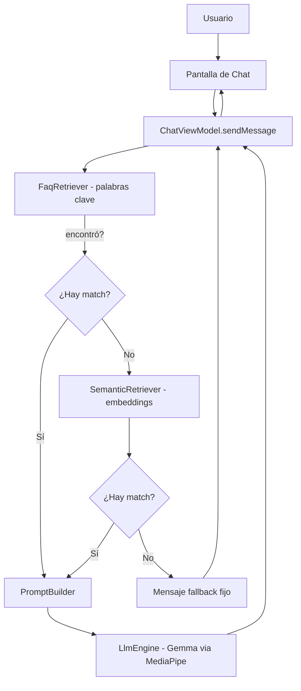

# Prompt de traspaso (actualizado) — Emprende ISTG: Asistente

> Documento para dárselo directo a otro agente de IA (u otra sesión) como
> contexto inicial. Reemplaza la versión anterior del traspaso: desde
> entonces se construyó la parte visual completa (Inicio/Menú/Chat con tema
> oscuro) y la búsqueda semántica con embeddings. En español, como se ha
> llevado todo el proyecto con el usuario.

---

## 0. Novedades desde el último traspaso

Lo nuevo desde la última vez que se documentó este proyecto:

1. **UI completa rediseñada**: pantalla de Inicio (robot mascota), Menú
   Principal (categorías del FAQ), Chat restyled — con tema oscuro y assets
   recuperados de un archivo de diseño (`.free`, formato Lunacy) que trajo
   el usuario.
2. **Búsqueda híbrida implementada** (código completo, ver sección 6):
   palabras clave → si falla, embeddings semánticos → si falla, mensaje de
   fallback. El LLM (Gemma) solo se invoca si alguna de las dos capas de
   búsqueda encontró contexto.
3. **Se recibió y revisó un análisis externo** ("la opinión") sobre el
   estado del proyecto, generado aparentemente por otra sesión de IA. Se
   verificó contra el código real (no se aceptó a ciegas) — ver sección 1
   para el detalle de en qué se coincidió y en qué no.
4. **Estado actual**: el código de los 5 pasos de embeddings está escrito,
   compila (tras corregir un par de errores de sintaxis del propio
   usuario al pegar los cambios), pero **la prueba real en dispositivo
   físico (Redmi Note 11) todavía no fue confirmada por el usuario** al
   momento de escribir esto — el siguiente agente debe pedir esa
   confirmación antes de asumir que funciona en la práctica.
5. **Subida del modelo a GitHub + optimización de latencia**: el `.task` de
   Gemma se subió a **GitHub Releases** (`japuero-istg/Chatbot_Istg`, tag
   `v1.0.0`) y `MODEL_URL` en `ModelManager.kt` ya apunta ahí (URL directa,
   verificada con HTTP 200). El usuario reportó **~30 s por respuesta** en su
   Redmi Note 11; se aplicaron ajustes de diagnóstico (backend CPU forzado,
   prompt top-2/≤300 chars, logs `LlmEngine` y `Retrieval`) pendientes de
   medir en dispositivo. Además se corrigieron íconos deprecados
   (`Icons.Default.Send`/`Login` → `Icons.AutoMirrored.*`).
   El repo aún **no tiene el código empujado** (solo README + tag): falta el
   primer `git push` desde la máquina local.
6. **Cambio de modelo a Gemma 3 270M q8 + bump del runtime (nuevo)**:
   para bajar la latencia se migró de `Gemma3-1B-IT int4` (~555 MB) a
   `gemma-3-270m-it q8` (~290 MB, `faq_model.task`, 303,950,933 bytes).
   El modelo 270M **crashaba** (SIGABRT) con `tasks-genai:0.10.27` por
   mismatch de esquema (issue MediaPipe #6083); se actualizó el runtime a
   **`tasks-genai:0.10.35`** (API Kotlin sin cambios, verificado con javap).
   Pendiente de probar en dispositivo.
7. **Voz en las respuestas (TTS, nuevo)**: auto-reproducción de cada
   respuesta con `android.speech.tts.TextToSpeech` del sistema (offline, sin
   permisos) + **icono de parlante mute** en el header del chat con la
   preferencia persistida en `SharedPreferences`. Compila OK; falta probarlo
   en el teléfono (si no hay voz en español, abre el instalador de TTS).

---

## 1. Revisión del análisis externo recibido

El usuario compartió un resumen/análisis (aparentemente de otra sesión de
IA) sobre el proyecto y pidió opinión. Se verificó contra los archivos
reales antes de responder. Resultado:

### De acuerdo
- `EmbeddingEngine.kt` y `LlmEngine.kt` no son redundantes (mismo patrón de
  wrapper, propósitos opuestos: uno genera texto, el otro mide significado).
- **Hallazgo real y confirmado**: `tools/md_to_json.py` NO tiene el
  diccionario de sinónimos (`SYNONYM_GROUPS`), pero `assets/faq.json` SÍ
  tiene los sinónimos ya aplicados. Es una regresión real: si alguien
  corre el script hoy, perdería los sinónimos sin darse cuenta. Causa:
  al armar el zip de la pantalla de menú, se copió el `faq.json` ya
  generado pero no se sincronizó el script que lo genera dentro de ese
  mismo zip.
- Las tarjetas del menú sí truncan mal los nombres largos de sección
  (`maxLines = 2` sin `overflow = TextOverflow.Ellipsis` en `MenuScreen.kt`) —
  confirmado revisando el código.
- El diseño híbrido (palabras clave → embeddings → fallback) es una buena
  decisión de ingeniería: evita gastar cómputo de embeddings cuando la
  búsqueda simple ya resuelve el caso.
- El plan de subir el `.task` a GitLab Generic Package Registry (repo
  público, sin token necesario para descargar) sigue siendo válido.

### En desacuerdo (importante para el siguiente agente)
- **NO eliminar/reemplazar el diccionario de sinónimos del script.** La
  recomendación externa era "regenerar el JSON con keywords limpios" (sin
  sinónimos) una vez que los embeddings estén andando. Se disiente: el
  diccionario de sinónimos es casi gratis en cómputo (comparación de texto,
  sin correr ningún modelo) y sigue evitando que preguntas comunes tengan
  que pasar por el paso más lento de embeddings. Mantenerlo como primera
  capa del híbrido, no reemplazarlo.
- **NO agregar ~6 preguntas nuevas por sección al FAQ** sin confirmación
  explícita del usuario — esto contradice una instrucción previa y
  explícita del usuario ("Más secciones no les voy a meter"). No asumir
  que cambió de opinión solo porque otra sesión lo sugirió.

### Decisión final del usuario sobre el `faq.json`
El usuario decidió **NO regenerar `faq.json` por ahora** — se queda tal
como está desplegado (con sinónimos), aunque el script que lo generaría ya
no los reproduzca. Es una decisión consciente y explícita, no un olvido:
**no tocar `faq.json` ni `tools/md_to_json.py` a menos que el usuario lo
pida directamente.**

---

## 2. Idea del MVP (sin cambios respecto al traspaso anterior)

**Emprende ISTG** es una app Android (Jetpack Compose) que conecta
emprendedores del Instituto Superior Tecnológico Guayaquil (ISTG). Este
sub-proyecto es un chatbot asistente de FAQ para esa app, con el requisito
no negociable de que la IA responda **100% on-device**, sin llamadas a la
nube para generar respuestas.

---

## 3. Stack tecnológico (actualizado)

| Capa | Tecnología |
|---|---|
| UI | Kotlin + Jetpack Compose (Material3), tema oscuro fijo |
| Arquitectura | MVVM |
| minSdk | 24 |
| LLM generativo on-device | `com.google.mediapipe:tasks-genai:0.10.35` (bumped desde 0.10.27 por crash de esquema con la 270M) — Gemma 3 270M IT q8 (`.task`, ~290 MB) |
| **Embeddings** | `com.google.mediapipe:tasks-text:0.10.35` — Universal Sentence Encoder (`.tflite`, ~5.8 MB, empaquetado en `assets/`, NO requiere descarga en runtime) |
| **Voz (TTS, nuevo)** | `android.speech.tts.TextToSpeech` del sistema — auto-reproducción de respuestas + mute persistido (icono parlante) |
| Serialización | `kotlinx-serialization-json:1.6.3` |
| Íconos | `androidx.compose.material:material-icons-extended` |
| Fuente del FAQ | Markdown → script Python → JSON (congelado, no regenerar por ahora) |
| Retrieval | **Híbrido**: palabras clave+sinónimos (`FaqRetriever`) → embeddings (`SemanticRetriever`) → fallback |

---

## 4. Arquitectura y flujo (actualizado con el híbrido)



---

## 5. Mapa de archivos (actualizado)

```
app/src/main/java/com/learning/mychatbotapp/
├── AppScreen.kt, SplashScreen.kt, MenuScreen.kt   # navegación + pantallas
├── ChatPage.kt, ChatViewModel.kt, MessageModel.kt, MainActivity.kt
├── TtsManager.kt               # NUEVO — TTS de respuestas + mute persistido
├── data/
│   ├── FaqEntry.kt, FaqRepository.kt
│   ├── FaqRetriever.kt        # búsqueda por palabras clave + sinónimos
│   └── SemanticRetriever.kt   # NUEVO — búsqueda por embeddings
├── llm/
│   ├── ModelManager.kt, LlmEngine.kt, PromptBuilder.kt
│   └── EmbeddingEngine.kt     # NUEVO — wrapper de MediaPipe TextEmbedder
└── ui/theme/  (Color.kt, Theme.kt, Type.kt — paleta oscura de marca)

app/src/main/assets/
├── faq.json                          # 60 preguntas, CONGELADO (no regenerar)
└── universal_sentence_encoder.tflite # NUEVO — modelo de embeddings, ~5.8 MB

app/src/main/res/drawable/
├── robot_mascot.png       # pantalla de Inicio
└── robot_face_logo.png    # avatar en el chat
```

---

## 6. Código del híbrido (ya escrito, en `ChatViewModel.sendMessage`)

```kotlin
// 1) Rápido y determinístico: palabras clave + sinónimos.
var matches = retriever.search(question)
// 2) Si no encontró nada, respaldo semántico (embeddings).
if (matches.isEmpty()) {
    matches = semanticRetriever?.search(question) ?: emptyList()
}
val answer = if (matches.isEmpty()) {
    FALLBACK_ANSWER
} else {
    // ... arma el prompt y llama a Gemma ...
}
```

`semanticRetriever` se prepara en paralelo al modelo de Gemma
(`prepareSemanticRetriever()` en `init {}`), precalculando embeddings de las
60 preguntas del FAQ una sola vez (`SemanticRetriever.warmUp()`).

**`minSimilarity = 0.5`** en `SemanticRetriever.kt` es un valor de partida
sin validar con datos reales — el siguiente agente debe ajustarlo según los
resultados de las pruebas del usuario.

---

## 7. Pendiente / próximos pasos (en orden)

1. **Probar en dispositivo la 270M + runtime 0.10.35**: reinstalar la app
   (estaba desinstalada tras el crash), verificar que el modelo nuevo (~290
   MB) se descarga y **no crashea**. Recién ahí **medir la latencia** con el
   contador `⏱` visible y el Logcat (`LlmEngine`: tokens del prompt, chars,
   tiempo en ms; `Retrieval`: capa que respondió).
2. **Probar el TTS** en el teléfono: que se lean las respuestas en español y
   que el icono de parlante mute/active y persista la preferencia.
3. Según los números, ajustar el prompt (más corto) y/o pasar a generación
   en streaming (`generateResponseAsync` + `ProgressListener`) para bajar
   los ~30 s actuales.
4. Según los resultados, **ajustar `minSimilarity`** si hace falta (subirlo
   si trae basura irrelevante, bajarlo si sigue cayendo al fallback).
5. ✅ **Truncación de nombres largos** arreglada (`MenuScreen.kt` →
   `CategoryCard`, `overflow = TextOverflow.Ellipsis`).
6. ✅ **Modelo subido a GitHub Releases** (`japuero-istg/Chatbot_Istg`, tag
   `v1.0.0`) y `MODEL_URL` en `ModelManager.kt` ya es la URL real.
7. ✅ **Crash de la 270M resuelto**: `tasks-genai` bump 0.10.27 → 0.10.35
   (mismatch de esquema, issue #6083); migrado a version catalog
   (`gradle/libs.versions.toml`).
8. ✅ **`MANUAL_TECNICO.md` actualizado** (modelo 270M, runtime, TTS,
   roadmap).
9. **Empujar el código al repo**: primer commit + `git push` local (con
   `.gitignore` ya creado). Decidir si incluir `document/` (8 MB) y
   `HANDOFF_PROMPT.md`.
10. **NO tocar** `faq.json` ni el diccionario de sinónimos del script salvo
    pedido explícito del usuario (ver sección 1).
11. **NO agregar** preguntas nuevas al FAQ salvo pedido explícito.

---

## 8. Lecciones aprendidas (acumuladas, incluye las nuevas)

- La copia local del usuario puede divergir de lo que se generó en el
  sandbox — pasó con `ModelManager.kt` antes, y de nuevo ahora con la
  ubicación de `SemanticRetriever.kt` al pegar el código. **Pedir siempre
  confirmación del contenido/ubicación real antes de asumir.**
- El usuario prefiere cambios **archivo por archivo, explicados**, y edita
  desde un editor de texto plano (no Android Studio) para ahorrar RAM —
  solo abre Android Studio para compilar/correr o cuando se toca
  `build.gradle.kts` (que sí requiere sync).
- Ante errores de compilación, pedir el **texto exacto** del error antes de
  proponer una solución — adivinar cuesta más tiempo que verificar.
- El usuario es capaz de leer y decidir sobre análisis técnicos de otras
  fuentes/sesiones, pero espera que se les revise con sentido crítico, no
  que se acepten automáticamente.
