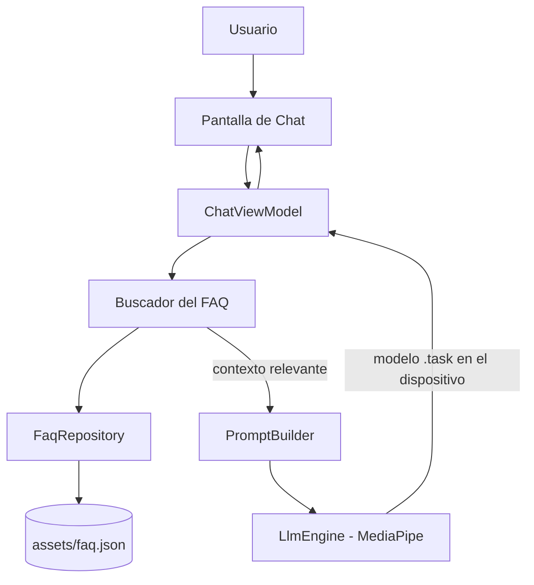

# Manual Técnico — Emprende ISTG: Asistente

## 1. Introducción

Este documento describe la arquitectura, el stack tecnológico y el funcionamiento
interno del **Asistente de Emprende ISTG**: una app Android que responde
preguntas frecuentes sobre la plataforma Emprende ISTG usando un modelo de
lenguaje (IA) que corre **completamente en el dispositivo**, sin depender de
servidores en la nube para responder.

**Audiencia**: cualquier persona que necesite entender, mantener o extender
este proyecto — incluido el propio desarrollador en el futuro.

---

## 2. Resumen de arquitectura

La app combina dos técnicas:

1. **RAG (Retrieval-Augmented Generation)**: antes de preguntarle a la IA,
   se busca en una base de conocimiento (el FAQ) qué información es relevante,
   y solo esa información se le entrega a la IA como contexto. Esto evita que
   el modelo invente respuestas sobre funciones que la app no tiene.
2. **Inferencia local (on-device)**: el modelo de lenguaje (Gemma 3 270M,
   cuantizado q8) corre directamente en el procesador del teléfono mediante
   MediaPipe LLM Inference API — no se envía ningún dato a servidores externos
   para generar la respuesta.



---

## 3. Stack tecnológico

| Componente | Tecnología / versión |
|---|---|
| Lenguaje | Kotlin |
| UI | Jetpack Compose + Material3 |
| Arquitectura | MVVM (ViewModel + estado de Compose) |
| Gradle / AGP | 8.5.0 |
| Kotlin | 1.9.0 |
| Compose BOM | 2024.04.01 |
| minSdk / targetSdk / compileSdk | 24 / 34 / 34 |
| Inferencia LLM on-device | `com.google.mediapipe:tasks-genai:0.10.35` |
| Modelo de lenguaje | Gemma 3 270M IT, cuantizado q8, formato `.task` (~290 MB, `faq_model.task`) |
| Voz (TTS) | `android.speech.tts.TextToSpeech` del sistema — respuestas en voz alta + mute persistido |
| Embeddings | `com.google.mediapipe:tasks-text:0.10.35` — Universal Sentence Encoder (`.tflite`, ~5.8 MB, en `assets/`, sin descarga en runtime) |
| Serialización | `org.jetbrains.kotlinx:kotlinx-serialization-json:1.6.3` |
| Íconos | `androidx.compose.material:material-icons-extended` |
| Fuente del FAQ | Markdown → script Python → JSON |

---

## 4. Estructura del proyecto

```
app/src/main/java/com/learning/mychatbotapp/
├── AppScreen.kt           # estado de navegación (Splash / Menu / Chat)
├── SplashScreen.kt        # pantalla de inicio con el robot mascota
├── MenuScreen.kt          # menú de categorías (una por sección del FAQ)
├── ChatPage.kt            # UI del chat
├── ChatViewModel.kt       # lógica central: orquesta todo el flujo
├── MessageModel.kt        # modelo de un mensaje (texto + rol)
├── TtsManager.kt          # lectura en voz alta de respuestas (TextToSpeech) + mute
├── MainActivity.kt        # punto de entrada, maneja la navegación y el TTS
├── data/
│   ├── FaqEntry.kt           # modelo de una entrada del FAQ
│   ├── FaqRepository.kt      # carga assets/faq.json
│   ├── FaqRetriever.kt       # capa 1 del híbrido: palabras clave
│   └── SemanticRetriever.kt  # capa 2 del híbrido: embeddings (significado)
├── llm/
│   ├── ModelManager.kt       # ubica/descarga el modelo .task (GitHub Releases)
│   ├── LlmEngine.kt          # wrapper de MediaPipe LLM Inference
│   ├── PromptBuilder.kt      # arma el prompt con contexto restringido
│   └── EmbeddingEngine.kt    # wrapper de MediaPipe TextEmbedder
└── ui/theme/
    ├── Color.kt           # paleta de colores de la marca
    ├── Theme.kt           # tema oscuro fijo de Compose
    └── Type.kt            # tipografía

app/src/main/assets/
├── faq.json               # 60 preguntas y respuestas, generadas del .md
└── universal_sentence_encoder.tflite   # modelo de embeddings, ~5.8 MB

app/src/main/res/drawable/
├── robot_mascot.png        # robot para la pantalla de Inicio
└── robot_face_logo.png     # avatar chico usado en el chat

tools/
├── faq_source.md           # FAQ original en markdown (fuente de verdad)
├── md_to_json.py           # script conversor markdown → JSON
└── README.md
```

---

## 5. Flujo de datos, paso a paso

1. El usuario abre la app → ve la pantalla **Inicio** (robot mascota).
2. Toca la pantalla → pasa al **Menú Principal**, que muestra una tarjeta
   por cada sección del FAQ (Negocios, Perfil, Favoritos, etc.).
3. El usuario puede:
   - **Tocar una tarjeta de categoría** → se envía automáticamente la
     primera pregunta de esa sección (garantiza coincidencia exacta).
   - **Escribir en "Pregunta directa"** → se envía el texto libre que
     haya escrito.
4. Cualquiera de los dos casos termina en la pantalla de **Chat**:
   - `ChatViewModel.sendMessage()` recibe la pregunta.
   - `FaqRetriever` busca las preguntas del FAQ más parecidas por palabras
     en común (los sinónimos ya vienen aplicados en `faq.json`).
   - Si no encuentra nada, entra la capa semántica: `SemanticRetriever`
     compara embeddings (similitud de significado, umbral 0.5).
   - Si ninguna capa encuentra contexto, se responde con el mensaje fijo
     "no tengo información sobre eso" — **sin gastar tiempo de cómputo
     en el modelo de IA**.
   - Si encuentra contexto, `PromptBuilder` arma un prompt que le
     ordena a la IA usar SOLO esa información y no inventar nada.
    - `LlmEngine` crea una sesión de MediaPipe, le pasa el prompt, y
      genera la respuesta usando el modelo Gemma cargado en memoria.
    - La respuesta se muestra en el chat.
    - `ChatViewModel` emite un evento `TtsEvent.Speak(answer)` que
      `MainActivity` consume para leer la respuesta en voz alta vía
      `TtsManager` (a menos que esté silenciado). Enviar una nueva
      pregunta emite `TtsEvent.Stop` para cortar la lectura anterior.
5. Un botón de "Inicio" en el chat regresa al Menú Principal. En la barra
   superior del chat hay un icono de **parlante** que silencia/activa la voz
   (la preferencia se persiste en `SharedPreferences`).

---

## 6. El modelo de lenguaje (`.task`)

- **Qué es**: un bundle de MediaPipe que contiene los pesos de Gemma 3 270M
  IT cuantizados en q8, más el tokenizer, empaquetados en un solo
  archivo binario (~290 MB).
- **Origen**: Hugging Face, organización oficial `litert-community`
  (`litert-community/gemma-3-270m-it`), variante `q8` (archivo
  `gemma3-270m-it-q8.task`). Requiere cuenta de HF y aceptar la licencia de
  Gemma para descargarlo.
- **No va empaquetado en el APK** — se gestiona por separado porque excede
  los límites razonables de tamaño de instalador.
- **Nombre de archivo esperado por el código**: `faq_model.task`.
- **Ubicación en el dispositivo**: `context.getExternalFilesDir(null)` —
  **no usar `/data/local/tmp/`**, ya que algunos fabricantes (confirmado en
  MIUI/Xiaomi) bloquean que la propia app lea esa carpeta aunque `adb
  shell` sí pueda escribir ahí.
- **Carga en código**: `LlmInference.createFromOptions()` con la ruta del
  archivo. Los parámetros de muestreo (`topK`, `temperature`) se configuran
  en un objeto separado, `LlmInferenceSession` / `LlmInferenceSessionOptions`
  — no en `LlmInferenceOptions` (cambio de API en la versión 0.10.27 de la
  librería).
- **Distribución en producción**: subido a GitHub Releases (repo público
  `japuero-istg/Chatbot_Istg`, tag `v1.0.0`) con el mismo nombre
  `faq_model.task`. `ModelManager.downloadModel()` lo descarga
  automáticamente la primera vez que se abre la app:
  `https://github.com/japuero-istg/Chatbot_Istg/releases/download/v1.0.0/faq_model.task`
- **Compatibilidad de runtime (importante)**: la 270M usa un esquema de
  modelo más nuevo que el runtime `tasks-genai:0.10.27`; cargarlo con esa
  versión provocaba un crash nativo (`SIGABRT`, "Cannot reserve space in a
  cache that isn't building"). Se actualizó a **`tasks-genai:0.10.35`**
  (la más reciente de la familia 0.10.x en Google Maven), que ya parsea el
  formato correctamente. La API Kotlin (`LlmInference` /
  `LlmInferenceSession`) no cambió entre esas versiones.

> **Nota**: Google marcó la MediaPipe LLM Inference API como
> "maintenance-only", recomendando su sucesora **LiteRT-LM** para proyectos
> nuevos. Se mantuvo MediaPipe aquí porque ya estaba funcionando, pero vale
> la pena revisarlo antes de invertir mucho más tiempo en esta ruta a futuro.

---

## 7. El pipeline del FAQ (markdown → JSON)

El contenido del FAQ vive en `tools/faq_source.md`, escrito con una
convención simple:
- `## Sección X: Nombre` → define la sección/categoría.
- `### ¿Pregunta?` → define una pregunta.
- El texto debajo de cada pregunta, hasta la siguiente, es la respuesta.

El script `tools/md_to_json.py`:
1. Lee `faq_source.md` línea por línea.
2. Agrupa cada pregunta con su respuesta y su sección.
3. Genera palabras clave (`keywords`) a partir del texto de la pregunta.
4. Expande esas palabras clave con **grupos de sinónimos** predefinidos
   (por ejemplo, "negocio" se asocia con "emprendimiento", "tienda",
   "publicar", "vender", etc.) para que la búsqueda no dependa de que el
   usuario use exactamente las mismas palabras que el FAQ original.
5. Escribe el resultado en `tools/faq.json`.

**Para actualizar el FAQ**:
```bash
cd tools
python3 md_to_json.py
cp faq.json ../app/src/main/assets/faq.json
```
No se necesita tocar ningún archivo Kotlin para esto.

---

## 8. El buscador híbrido (`FaqRetriever` + `SemanticRetriever`)

La búsqueda tiene dos capas en cascada:

1. **Palabras clave (`FaqRetriever`)** — sin IA, comparación de texto simple
   y determinística:
   - Normaliza el texto (minúsculas, sin tildes, sin signos de puntuación).
   - Elimina palabras vacías ("como", "que", "para", etc.).
   - Calcula un puntaje de coincidencia por entrada.
   - Devuelve las entradas con mayor puntaje, si superan un umbral mínimo.
2. **Semántica (`SemanticRetriever`)** — solo si la capa 1 no encontró nada:
   - Convierte la pregunta en un embedding (vector de significado).
   - La compara con los embeddings de las 60 preguntas del FAQ (calculados
     una sola vez al iniciar la app, `warmUp()`).
   - Acepta las coincidencias con similitud coseno ≥ `minSimilarity` (0.5).

Si ambas capas fallan, se responde con el mensaje fijo `FALLBACK_ANSWER` sin
invocar al LLM.

---

## 9. Interfaz y diseño visual

- **Tema**: oscuro, fijo (no seguimos el tema del sistema ni Material You),
  con la siguiente paleta:

| Uso | Color |
|---|---|
| Fondo general | `#1A1D23` |
| Tarjetas | `#3A3C41` |
| Barra de texto | `#323339` |
| Texto placeholder | `#9B9C9E` |
| Acento azul (botones) | `#0C70F2` |
| Acento azul claro (íconos) | `#37A6F0` |
| Texto sobre fondo oscuro | `#E1E7F2` (casi blanco) |

- **Pantallas**:
  1. **Inicio** — robot mascota, toda la pantalla es tocable para continuar.
  2. **Menú Principal** — grid de 2 columnas con una tarjeta por sección
     del FAQ (ícono + nombre), y una barra de "Pregunta directa" fija abajo.
  3. **Chat** — burbujas de conversación (azul para el usuario, gris oscuro
     para el bot), con el avatar del robot junto a las respuestas, un
     botón de "Inicio" para volver al menú, y un icono de **parlante**
     (activado/silenciado) que controla la lectura en voz alta de las
     respuestas. Debajo de cada respuesta del modelo se muestra el tiempo
     que tardó en generarse (`⏱ X.X s`).

---

## 10. Trabajo pendiente / roadmap

1. ✅ **Búsqueda semántica con embeddings**: implementada (`SemanticRetriever`
   + `EmbeddingEngine` con `tasks-text:0.10.35`), funcionando como capa de
   respaldo del híbrido. Pendiente: **calibrar `minSimilarity` (0.5)** con
   resultados reales del dispositivo.
2. ✅ **Distribución de producción del modelo**: `MODEL_URL` apunta a GitHub
   Releases (`japuero-istg/Chatbot_Istg`, tag `v1.0.0`). Descarga automática
   al primer uso.
3. **Rendimiento / latencia**: el usuario reportó ~30 s por respuesta en su
   Redmi Note 11. Se cambiaron los modelos a **Gemma 3 270M q8** (~290 MB,
   más liviano que el 1B) y se añadieron logs de diagnóstico (`LlmEngine`:
   tokens del prompt, chars de respuesta, tiempo en ms; `Retrieval`: capa
   usada) y un contador visible `⏱` por respuesta para medir la base real.
   Pendiente: validar en dispositivo (el crash del runtime ya fue resuelto
   con `tasks-genai:0.10.35`) y decidir entre prompt más corto y/o
   generación en streaming.
4. ✅ **Voz/TTS**: implementada la lectura en voz alta de las respuestas con
   `TextToSpeech` nativo de Android, **auto-reproducción** y un icono de
   parlante en el chat para silenciarla (preferencia persistida en
   `SharedPreferences`). Si el dispositivo no tiene voz en español, la app
   abre el instalador de TTS.
5. **Seguridad**: confirmar que la API key vieja de Gemini (del proyecto
   original, ya eliminada del código) fue revocada en Google AI Studio.

---

## 11. Requisitos de entorno de desarrollo

- Android Studio (versión reciente, compatible con AGP 8.5.0).
- JDK compatible con Kotlin 1.9.0 / Compose (viene incluido con Android
  Studio).
- Un dispositivo Android físico (recomendado) o emulador con API 24+.
  El modelo de IA es pesado computacionalmente — un dispositivo físico de
  gama media/alta da mejor experiencia que un emulador.
- `adb` (Android Debug Bridge), incluido con Android Studio / Android SDK
  Platform Tools.
- En Linux: reglas `udev` para que `adb` reconozca dispositivos Android
  (ver sección 13).
- Cuenta de Hugging Face (para descargar el modelo `.task` de
  `litert-community`, requiere aceptar la licencia de Gemma).

---

## 12. Guía de instalación y primera ejecución

1. Clonar/descomprimir el proyecto.
2. Abrir en Android Studio (`File → Open`, seleccionar la carpeta raíz).
3. Esperar el Gradle Sync.
4. Conectar el dispositivo, verificar con `adb devices`.
5. Run ▶️ en Android Studio. **La primera vez**, la app descarga el modelo
   `.task` (~290 MB) desde GitHub Releases y muestra el progreso en la
   pantalla; no hace falta copiarlo manualmente.
   (Alternativa manual: `adb push` del `.task` a la ruta de la sección 13).

---

## 13. Comandos ADB de referencia

```bash
# Ver dispositivos conectados
adb devices

# Reiniciar el servidor adb (soluciona "unauthorized"/"offline")
adb kill-server
adb start-server
adb devices

# Linux: si el dispositivo no aparece en absoluto
lsusb   # confirma que se ve a nivel de hardware USB

# Linux: instalar reglas udev si lsusb sí lo ve pero adb no
sudo wget -O /etc/udev/rules.d/51-android.rules \
  https://raw.githubusercontent.com/M0Rf30/android-udev-rules/main/51-android.rules
sudo chmod 644 /etc/udev/rules.d/51-android.rules
sudo udevadm control --reload-rules
sudo udevadm trigger

# Copiar el modelo al dispositivo (ruta correcta)
adb shell mkdir -p /sdcard/Android/data/com.learning.mychatbotapp/files/
adb push ruta/local/al/modelo.task \
  /sdcard/Android/data/com.learning.mychatbotapp/files/faq_model.task

# Verificar que llegó bien (tamaño esperado ~303,950,933 bytes para la 270M q8)
adb shell ls -la /sdcard/Android/data/com.learning.mychatbotapp/files/
```

---

## 14. Problemas ya enfrentados y su solución

| Problema | Causa | Solución |
|---|---|---|
| `adb devices` no muestra el dispositivo | Faltan reglas udev en Linux | Instalar reglas udev (sección 13) |
| Dispositivo aparece como `unauthorized` | No se aceptó el popup de depuración USB en el celular | Aceptar el popup, marcar "permitir siempre" |
| `Unresolved reference: setTopK` al compilar | La API de MediaPipe (0.10.27) movió `topK`/`temperature` de `LlmInferenceOptions` a `LlmInferenceSession` | Configurar esos parámetros en una `LlmInferenceSession` separada, creada por cada generación |
| El modelo nunca se detecta (`isModelReady()` siempre `false`) aunque el archivo existe | El archivo estaba en `/data/local/tmp/`, que la app no puede leer en MIUI | Usar `context.getExternalFilesDir(null)` en vez de esa ruta |
| El bot responde "no tengo información" para preguntas que sí debería saber | El buscador por palabras clave no encuentra coincidencia si el usuario usa sinónimos no contemplados | Capa 2 del híbrido: búsqueda por embeddings (`SemanticRetriever`, similitud coseno ≥ 0.5) |
| Respuesta lenta (~30 s) en el Redmi Note 11 | Prompt con varias entradas del FAQ + `maxTokens=512` llenan la ventana; decodificación en CPU | Diagnóstico con Logcat (`LlmEngine`/`Retrieval`); contexto top-2 y respuestas de ≤300 chars en el prompt; probar streaming |
| Crash al abrir la app con el modelo nuevo: `SIGABRT`, "Cannot reserve space in a cache that isn't building" (thread `drishti`, BuildId `e7cb5eb...`) | El `gemma3-270m-it-q8.task` usa un esquema de modelo más nuevo que el runtime `tasks-genai:0.10.27` (mismatch de versión/schema, issue MediaPipe #6083) | Actualizar a `tasks-genai:0.10.35` en `app/build.gradle.kts` (vía version catalog); reinstalar la app y dejar que re-descargue el modelo |
| La app no habla en voz alta (TTS) | El dispositivo no tiene un motor TTS con voz en español | `TtsManager` detecta la ausencia y abre `ACTION_INSTALL_TTS_DATA` para instalar la voz; el icono de parlante debe estar activado |

---

## 15. Seguridad

- El proyecto original (plantilla de la que partió este) tenía una API key
  de Gemini expuesta en texto plano en el código — fue eliminada junto con
  la dependencia del SDK de Gemini en la nube. **Revisar que esa key haya
  sido revocada en Google AI Studio** si aún no se ha hecho.
- No subir nunca API keys, tokens de acceso, ni URLs de modelos con
  credenciales embebidas a un repositorio público.

---

## 16. Glosario

- **RAG (Retrieval-Augmented Generation)**: técnica que busca información
  relevante antes de generarle una respuesta a un modelo de IA, para que
  no tenga que "saber" todo de memoria ni inventar datos.
- **Embedding**: representación numérica (vector) de un texto que captura
  su significado; textos con significado parecido tienen vectores cercanos.
- **Cuantización (quantization)**: técnica para reducir el tamaño y uso de
  memoria de un modelo de IA, representando sus números internos con menos
  precisión (por ejemplo, int4 en vez de float32).
- **Token**: unidad mínima de texto que procesa un modelo de lenguaje
  (puede ser una palabra, parte de una palabra, o un signo de puntuación).
- **On-device / local**: que corre en el propio dispositivo del usuario,
  sin enviar datos a un servidor externo para procesarlos.
